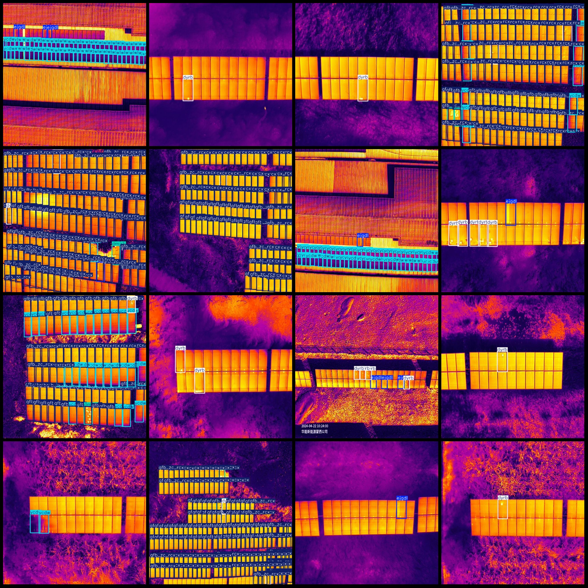
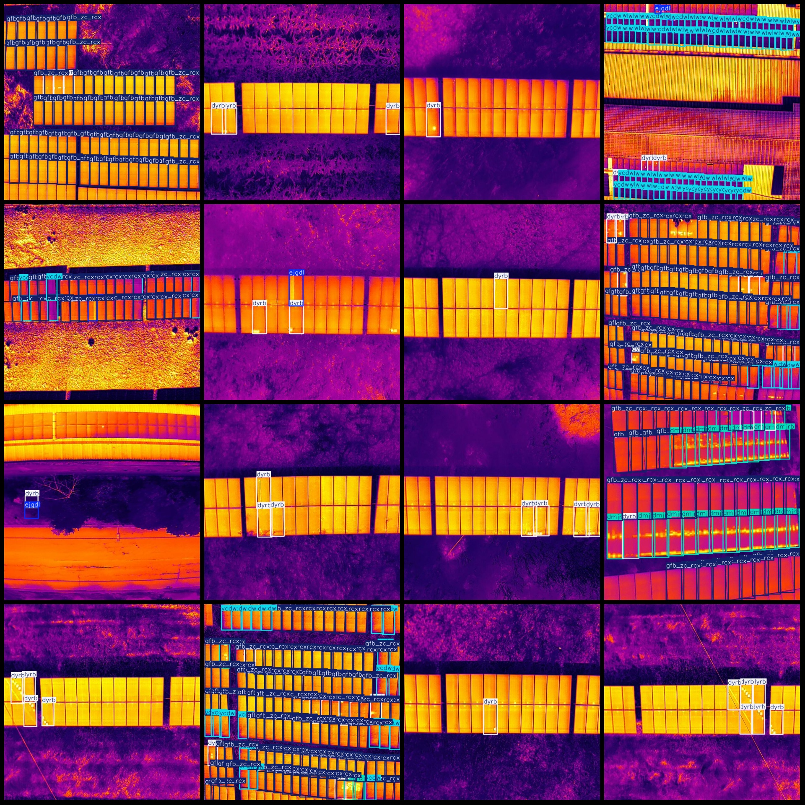

# Drone-View Infrared Image Solar PV Module Hotspot Abnormal Low Temperature Diode Short Circuit Defect Detection Dataset (VOC+YOLO Format) - 1660 Images in Pascal VOC + YOLO

Dataset format: Pascal VOC format + YOLO format (without split path txt files, only containing jpg images and corresponding VOC format xml files and yolo format txt files)

Number of images (jpg file counts): 1660
Number of annotations (xml file counts): 1660
Number of annotations (txt file counts): 1660
Number of annotation categories: 5
Annotation category names according to the labels folder classes.txt: ["dmjrb", "dyrb", "ejgdl", "gfb_zc_rcx", "ycdw"]
Number of bounding boxes for each category:
dmjrb (large hotspot) = 1453
dyrb (single hotspot) = 3265
ejgdl (diode short circuit) = 502
gfb_zc_rcx (normal hot imaging of the PV module) = 32248
ycdw (abnormal low temperature) = 5853
Total bounding box count: 43321
Image resolution: 640x640
Annotation tool used: labelImg
Annotation rule: draw a bounding box for each category
Important note: The dataset does not include any splits for training, validation, or testing; you will need to manually divide it yourself.
Special declaration: This dataset does not guarantee any accuracy of trained models or weight files.
Image preview:

## Images

Here is a pay link on Stripe ( https://buy.stripe.com/3cs8yP7sY87d0vu9AB ). Please contact me lonlonago@foxmail.com after funding $89, and I will send you a complete data files , thank you!

